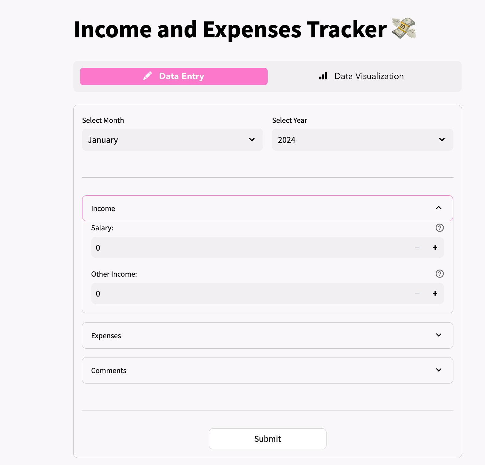
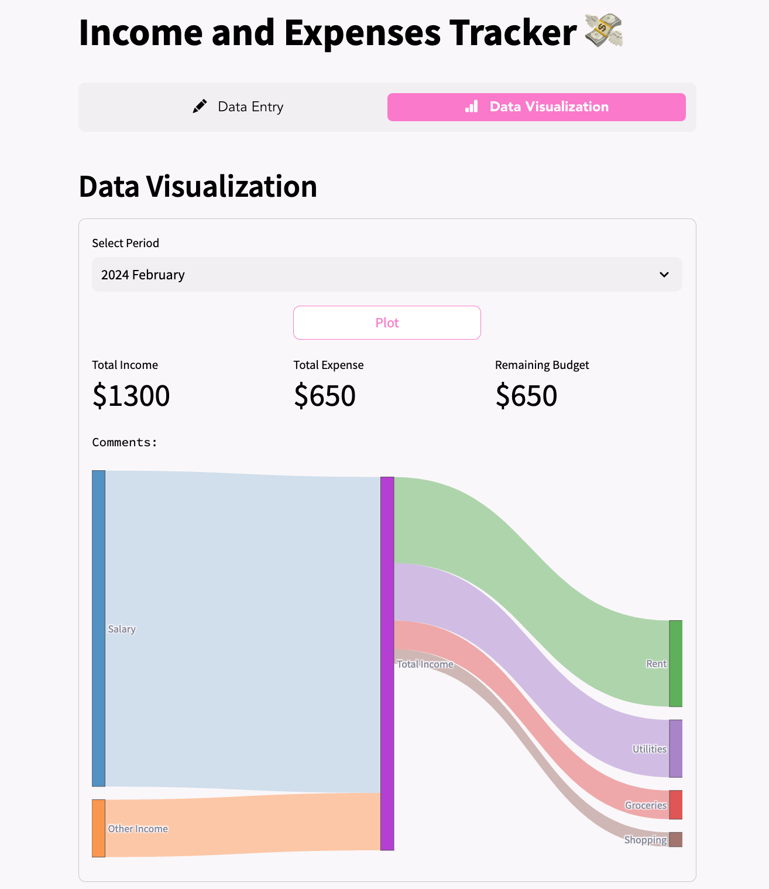

## Expense Manager App using StreamLit and NoSQL
#### Features:
- Use Streamlit to build the front-end components.
- Use NoSQL MongoDB connection to handle the back-end.

View 1:

View 2:

The app will allow the user to:
- Input their income and expenses.
- Store the entered information in the database.
- Retrieve the income and expenses for the specified period and plot an interactive Sankey Diagram.